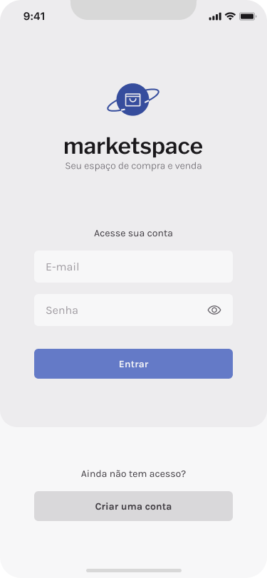

# Marketplace ( App para anúncios )

<div style="display: flex; gap: 10px; margin-bottom: 20px;">
    
    
</div>

# Telas

<ul>
    <li>Login</li>
    <li>Cadastro</li>
    <li>Home</li>
    <li>Detalhes do anúncio</li>
    <li>Meus anúncios</li>
    <li>Detalhes do meu anúncio</li>
    <li>Criar anúncio</li>
    <li>Pré visualização do anúncio</li>
</ul>

# Instalação

Siga os passos abaixo para configurar e executar o projeto localmente:

## Pré-requisitos
- [Node.js](https://nodejs.org/) (versão 16 ou superior)
- [Git](https://git-scm.com/)
- [Expo CLI](https://docs.expo.dev/get-started/installation/) instalado globalmente

## 1. Clonar o repositório
```bash
1. git clone https://github.com/lucasnather/martplace-front-end.git
2. cd martplace-front-end
3. npm install
4. npm run start
5. Agora é só ler o QR CODE
